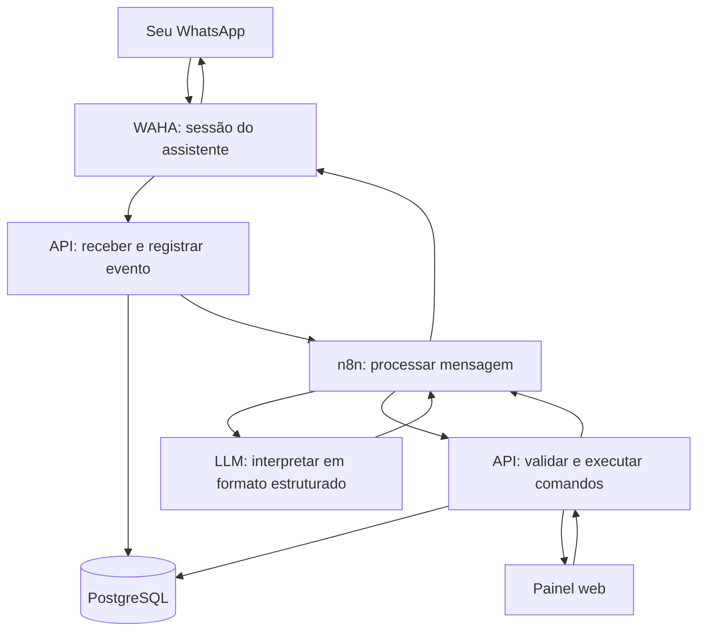

# AgendaMagno — plano do organizador pessoal pelo WhatsApp

Status: MVP implementado localmente; integrações externas aguardam configuração e validação.  
Atualizado em: 17/09/2026.

**Implementação:** painel, API compartilhada, banco local para testes/Neon, interpretador básico com adaptadores de LLM e três workflows n8n estão no repositório. Execute `./iniciar.sh` para testar. A documentação operacional e os limites da versão estão no [README.md](README.md). As ideias de evolução das fases 3 e 4 não foram implementadas. O pareamento com número real e a escolha da LLM continuam pendentes.

A proposta é usar o WhatsApp para capturar, organizar e consultar atividades em linguagem natural. Um painel web permite visualizar e corrigir os mesmos registros quando for conveniente. A primeira versão será voltada ao seu uso pessoal, com grupos e tarefas.

**Recomendação:** começar com WAHA conectando o WhatsApp, n8n coordenando as integrações, uma LLM interpretando mensagens, uma API pequena aplicando as regras e PostgreSQL no Neon armazenando os dados. O painel e a API podem ficar em um único projeto Next.js; a solução de login permanece a definir.

**Restrições confirmadas:** objetivo de custo zero; banco de produção no Neon; LLM ainda não escolhida, com preferência por API gratuita; número dedicado do assistente ainda inexistente. A hospedagem gratuita está em avaliação, sem serviço contratado ou implantação externa iniciada.

**Integração escolhida para o planejamento:** WAHA auto-hospedado, conforme sua preferência. A documentação atual informa que, desde a versão 2026.6.1, todos os recursos estão gratuitos no Core, incluindo os que antes pertenciam ao Plus. A infraestrutura para executá-lo continua sendo uma parte do projeto. [FAQ do WAHA](https://waha.devlike.pro/docs/overview/faq/).

As escolhas e comportamentos abaixo são propostas, inclusive os significados de “retirar”, “excluir” e “desfazer”. As decisões para sua revisão estão no final.

## 1. Experiência principal

Você conversa, no seu WhatsApp habitual, com um contato dedicado ao AgendaMagno. “Grupo de atividades” significa uma categoria dentro do sistema, como Disciplina X, Casa ou Trabalho. Criar essa categoria não cria uma conversa em grupo no WhatsApp.

Uma conversa de exemplo:

```text
Você: Crie um grupo chamado Disciplina X.
AgendaMagno: Grupo Disciplina X criado.

Você: Adicione ler capítulo 3 e resolver a lista 1 nesse grupo.
AgendaMagno: Adicionei 2 tarefas em Disciplina X:
             #12 Ler capítulo 3
             #13 Resolver a lista 1

Você: Na lista 1, acrescente: fazer somente as questões pares.
AgendaMagno: Acrescentei à descrição de #13 Resolver a lista 1:
             “Fazer somente as questões pares.”

Você: Finalizei a tarefa ler capítulo 3.
AgendaMagno: #12 Ler capítulo 3 finalizada e movida para a lixeira.
             Será excluída automaticamente em 30 dias, conforme sua configuração.
             Você pode restaurá-la antes da exclusão.

Você: O que falta nessa disciplina?
AgendaMagno: Disciplina X tem 1 tarefa pendente:
             #13 Resolver a lista 1 — sem prazo.
```

O objetivo é conseguir fazer esse ciclo inteiro pelo WhatsApp. A validação visual é opcional; ações claras já ficam salvas e aparecem no painel. Os 30 dias do exemplo são uma sugestão de configuração inicial, que você poderá alterar.

## 2. Organização inicial dos dados

| Conceito | Como usar |
| --- | --- |
| Grupo | Uma disciplina, projeto ou área, sem subgrupos na primeira versão. |
| Tarefa ou atividade | Um mesmo tipo de registro, com título e situação. |
| Descrição | Detalhes e observações da tarefa, preservados ao acrescentar informações. |
| Caixa de entrada | Tarefas ainda sem grupo; permite anotar sem decidir onde organizar. |
| Prazo | Data opcional; horário somente quando informado. |
| Prioridade | Baixa, normal ou alta; padrão normal, sem inferir urgência apenas pelo assunto. |
| Situação | Pendente, em andamento ou concluída. Ao concluir, a tarefa vai para a lixeira. |
| Lixeira | Guarda temporariamente tarefas finalizadas ou descartadas, com data de exclusão automática e opção de restauração. |
| Configuração da lixeira | Quantidade de dias até excluir definitivamente; editável no painel e pelo WhatsApp. |
| Histórico | Registro das alterações, com origem WhatsApp ou painel, mantido enquanto a tarefa existir. |

Cada tarefa terá no máximo um grupo. Retirar a tarefa de um grupo a devolve à Caixa de entrada. Etiquetas, subtarefas e várias classificações ficam para uma etapa posterior.

Somente o título será obrigatório ao capturar uma tarefa. Não exigir prazo, prioridade ou descrição torna a anotação rápida.

## 3. Comandos da primeira versão

Não será necessário decorar uma sintaxe. Os exemplos abaixo representam intenções que podem ser escritas de outras formas, inclusive com abreviações e pequenos erros de digitação.

| Objetivo | Exemplos de mensagens |
| --- | --- |
| Criar grupo | “Crie um grupo chamado Disciplina X.” |
| Listar grupos | “Quais grupos existem?” |
| Renomear grupo | “Mude Disciplina X para Cálculo I.” |
| Criar tarefa | “Adicione revisar derivadas em Cálculo I.” |
| Capturar rapidamente | “Anota: comprar pilhas.” → Caixa de entrada. |
| Criar uma lista de tarefas | “Em Cálculo I, adicione ler capítulo 3, fazer lista 1 e revisar limites.” |
| Listar tarefas | “Quais tarefas existem em Cálculo I?” |
| Consultar detalhes | “Mostre a descrição da lista 1.” |
| Acrescentar descrição | “Acrescente na lista 1: resolver questões pares.” |
| Substituir descrição | “Troque a descrição da lista 1 por: resolver questões 2 e 4.” |
| Renomear tarefa | “Renomeie revisar limites para revisar limites laterais.” |
| Definir prazo | “A lista 1 é para sexta, dia 18.” |
| Remover prazo | “Deixe a revisão de limites sem prazo.” |
| Definir prioridade | “Coloque prioridade alta na lista 1.” |
| Começar | “Comecei a lista 1.” |
| Finalizar e enviar à lixeira | “Finalizei a tarefa lista 1.” / “Terminei a lista 1.” / “Concluí a lista 1.” |
| Reabrir ou restaurar | “Marque a lista 1 como pendente de novo.” / “Restaure a lista 1 da lixeira.” |
| Mover entre grupos | “Mova revisar limites para Preparação da prova.” |
| Retirar do grupo | “Tire revisar limites de Cálculo I.” → Caixa de entrada. |
| Descartar e recuperar | “Exclua comprar pilhas.” → lixeira. / “Recupere a tarefa comprar pilhas.” |
| Consultar a lixeira | “Quais tarefas estão na lixeira?” / “Quando a lista 1 será excluída?” |
| Configurar a exclusão automática | “Exclua as tarefas da lixeira depois de 15 dias.” / “Qual é o prazo da lixeira?” |
| Consultar por prazo | “O que vence hoje?” / “O que está atrasado?” |
| Buscar | “Onde anotei algo sobre derivadas?” |
| Corrigir uma ação | “Desfaça a última alteração.” |
| Obter ajuda | “O que posso fazer por aqui?” |

Listagens de tarefas mostrarão, por padrão, pendentes e em andamento que estejam fora da lixeira, deixando esse filtro explícito. “Inclua as concluídas” inclui as finalizadas ainda retidas na lixeira; “mostre a lixeira” inclui também as descartadas sem conclusão. Itens já excluídos definitivamente não aparecem. Listas longas terão total e continuação por “mostrar mais”; uma lista parcial não deve parecer completa.

## 4. Ideias para evoluir a praticidade

| Ideia | Exemplo | Momento sugerido |
| --- | --- | --- |
| Áudio convertido em tarefas | Enviar um áudio enumerando o que precisa fazer. | Após o MVP. |
| Classificação sugerida | “Organize o que está sem grupo e me mostre a sugestão.” | Após o MVP. |
| Regras pessoais | “Quando eu falar lista de cálculo, use o grupo Cálculo I.” | Após o MVP. |
| Etiquetas | “Marque essas tarefas como faculdade e prova.” | Após o MVP. |
| Checklist ou subtarefas | “Divida fazer o trabalho em pesquisa, escrita e revisão.” | Após o MVP. |
| Plano de execução | “Tenho 40 minutos. O que dá para fazer?” | Quando houver estimativas de duração. |
| Extração de texto encaminhado | “Transforme esse aviso do professor em tarefas.” | Após o MVP. |
| Links e materiais | “Guarde este link na tarefa da apresentação.” | URL na descrição já cabe no MVP; leitura automática depois. |
| Sugestão de duplicatas | “Acho que anotei isso duas vezes. Confira.” | Após o MVP. |
| Reorganização em lote | “Passe as tarefas atrasadas de Cálculo para a próxima semana.” | Após o MVP, com prévia. |
| Resumo sob demanda | “Resuma o que falta para terminar essa disciplina.” | Após o MVP; consulta simples já entra antes. |
| Lembretes | “Me lembre da lista 1 amanhã às 19h.” | Após validar sessão estável, agendamento no n8n e envio pelo WAHA. |
| Resumo programado | “Todo dia às 8h me mostre as prioridades.” | Junto dos lembretes. |
| Recorrência | “Crie revisar anotações toda segunda às 18h.” | Depois dos lembretes. |
| Revisão semanal | “O que concluí esta semana e o que ficou parado?” | Após o MVP, usando o histórico ainda disponível; respeitar a retenção da lixeira. |
| Dependências | “Só posso escrever a conclusão depois de terminar a pesquisa.” | Evolução futura. |
| Busca por significado | “Cadê aquela atividade sobre o trabalho em equipe?” | Se a busca textual se mostrar insuficiente. |
| Foto de anotação | “Leia esta foto e extraia os exercícios que preciso fazer.” | Evolução futura. |

As três evoluções que eu priorizaria são **áudio**, **classificação assistida da Caixa de entrada** e **lembretes**. Elas reduzem o esforço de registrar, organizar e lembrar de agir.

Há uma distinção importante para a experiência: “entregar sexta” define prazo; “me lembrar quinta às 19h” define notificação. Cadastrar um prazo não deve ativar lembretes sem você escolher esse comportamento.

## 5. Regras para a IA organizar sem atrapalhar

| Situação | Comportamento proposto |
| --- | --- |
| Pedido claro e reversível | Executar e responder com o resultado, sem pedir confirmação a cada mensagem. |
| Anotação sem grupo | Salvar na Caixa de entrada e informar isso. |
| Grupo explícito ou referência recente única | Usar o grupo identificado e mencioná-lo na resposta. |
| Grupo solicitado não existe | Perguntar se deve criá-lo ou usar um existente. Se o pedido já disser para criar o grupo, executar. |
| Duas tarefas com o mesmo nome | Mostrar opções com grupo e código; aguardar escolha. |
| “Essa tarefa”, “nesse grupo” ou “a segunda” | Resolver pela referência recente e pela última lista enviada, com validade proposta de 30 minutos; perguntar se houver dúvida. |
| “Tire a tarefa do grupo” | Mover para a Caixa de entrada. |
| “Finalizei”, “terminei” ou “concluí” a tarefa | Registrar conclusão, mover para a lixeira e informar o prazo e a data de exclusão automática. |
| “Exclua a tarefa” | Mover para a mesma lixeira como descarte, sem marcar como concluída; informar até quando pode ser recuperada. |
| “Restaure” ou “reabra” a tarefa | Retirar da lixeira, marcar como pendente e cancelar a exclusão agendada, se ela ainda existir. |
| “Apague o grupo com tudo” | No MVP, explicar que essa operação ampla ainda não está disponível. Futuramente, mostrar itens afetados e solicitar confirmação. |
| “Acrescente à descrição” | Anexar o novo conteúdo, mantendo o anterior. |
| Datas relativas | Usar a data da mensagem e o fuso America/Bahia; repetir a data absoluta na resposta. |
| Dia sem horário | Guardar somente a data; considerar atrasada após o fim daquele dia local. |
| Data ambígua ou contraditória | Pedir esclarecimento; não inventar um horário nem escolher silenciosamente entre “sexta” e um dia numérico incompatível. |
| Várias ações na mesma mensagem | Interpretar e validar o conjunto antes de alterar dados. Se houver ambiguidade ou ação não suportada, esclarecer antes de aplicar. |
| Possível duplicata de conteúdo | No MVP, mensagens distintas iguais continuam válidas; detectar conteúdo duplicado e sugerir revisão fica para depois. |
| Falha ao salvar | Informar a falha; somente confirmar sucesso depois da persistência. |

O contexto da conversa guardará referências a registros reais. Não dependerá apenas de enviar todo o histórico para a LLM. Quando uma pergunta ficar pendente, a resposta deve ser vinculada àquela pergunta; um novo comando claro não pode ser confundido automaticamente com uma confirmação.

“Desfazer” abrange criação de tarefas individuais ou pequenas listas, edição de campos, movimentação, mudança de situação, envio à lixeira e recuperação. Reverte a última operação da conversa como um conjunto e preserva o histórico enquanto as tarefas existirem; desfazer uma criação move as tarefas criadas para a lixeira. Desfazer uma finalização restaura a situação anterior e cancela a exclusão agendada. Operações sobre grupos e configurações não terão reversão automática no MVP: se a última operação for desses tipos, explicar a limitação sem desfazer uma operação anterior.

Se houve uma edição posterior pelo painel que tornaria a reversão insegura, o sistema explica o conflito e pede uma correção específica. A proposta é permitir desfazer por 24 horas, desde que nenhuma tarefa envolvida já tenha sido excluída definitivamente. Depois desse prazo de desfazer, ainda é possível restaurar uma tarefa enquanto ela estiver na lixeira. A exclusão definitiva não pode ser desfeita pela conversa ou pelo painel.

Na primeira versão, organização automática significa extrair título e campos explicitamente informados, reconhecer grupos existentes e usar contexto inequívoco. Depois, a LLM poderá sugerir categorias por conteúdo. Mudanças em massa e fusões de tarefas terão prévia; regras de classificação que você configurar poderão ser aplicadas diretamente.

### Ciclo de conclusão e lixeira

O comportamento solicitado entra no MVP: **tarefa ativa → “finalizei” → concluída na lixeira → exclusão definitiva após X dias**. A lixeira substitui a proposta anterior de arquivamento por tempo indeterminado.

- **Prazo configurável:** `trash_retention_days`, em dias inteiros positivos. Sugestão inicial de 30 dias, ainda para sua validação. O painel terá “Excluir tarefas da lixeira após X dias”; a mesma preferência poderá ser consultada e alterada por mensagem, sem afetar prazos de entrega das tarefas.
- **Contagem:** começa quando a tarefa entra na lixeira. A API calcula e salva o instante de exclusão como entrada + X períodos de 24 horas, exibindo a data e o horário em America/Bahia. Repetir “finalizei” para uma tarefa já concluída na lixeira não reinicia a contagem.
- **Mudança da configuração:** vale para as próximas entradas na lixeira. Tarefas que já estão nela mantêm a data anteriormente informada. A resposta ao mudar X explicita esse efeito; recalcular itens existentes fica fora do MVP.
- **Restauração:** preserva título, descrição, prazo, prioridade e grupo original, e deixa a tarefa pendente. Se o grupo não estiver mais disponível, usa a Caixa de entrada e informa isso. Limpa os campos de conclusão e de exclusão programada, mantendo o evento de conclusão no histórico até a exclusão definitiva da tarefa. Uma nova finalização inicia outra contagem com a configuração vigente.
- **Limpeza automática:** uma rotina do n8n chama a API a cada hora. A API exclui os itens cujo prazo já venceu e que continuam na lixeira. A exclusão acontece na próxima execução bem-sucedida, sem solicitar confirmação a cada item. Se a rotina ficar indisponível, retoma os itens vencidos quando voltar. A restauração continua possível enquanto o item ainda não tiver sido efetivamente excluído.
- **Histórico e resumos:** a exclusão definitiva remove o registro da tarefa e suas cópias detalhadas no histórico e nos dados de reversão da aplicação. Podem permanecer apenas identificadores técnicos mínimos para impedir reprocessamento, sem título ou descrição. Consultas históricas não devem inventar itens apagados. Logs e backups seguem suas retenções próprias; a limpeza não apaga mensagens já enviadas no WhatsApp.

Uma tarefa concluída ou descartada sai das listas ativas e, quando lembretes forem implementados, deixa de gerar novos avisos. A API deve resolver restauração e limpeza concorrentes na mesma proteção transacional, para que uma tarefa restaurada não seja excluída por uma seleção antiga da rotina.

## 6. Escopo e fases

| Fase | Entrega | Critério para avançar |
| --- | --- | --- |
| 0 — Validar a integração | Executar WAHA, parear a sessão por QR, receber/responder uma mensagem, testar webhook autenticado e reinício com sessão persistente. | Conversa de teste funcionando sem ciclos de resposta e conexão retomada após reinício. |
| 1 — Núcleo do MVP | Banco, API, autorização, grupos, tarefas, Caixa de entrada, lixeira, configuração de retenção, histórico e interpretação de texto. | Comandos essenciais funcionando com mensagens simuladas e reais. |
| 2 — MVP utilizável | Painel simples, filtros, edição, tratamento de ambiguidades, desfazer, limpeza automática da lixeira e recuperação de falhas. | Critérios de aceitação aprovados e uso cotidiano possível. |
| 3 — Captura e organização | Áudio, classificação sugerida, regras pessoais, etiquetas e checklists, escolhidos conforme o uso. | Menor esforço de anotação sem aumento de correções. |
| 4 — Proatividade | Lembretes, resumos agendados e, depois, recorrência. | Sessão estável, horários, preferências de envio e recuperação de falhas validados. |

O MVP completo corresponde às fases 1 e 2. Inclui texto, uma pessoa autorizada, grupos, tarefas com descrição/prazo/prioridade, finalização com lixeira e retenção configurável, busca textual, criação de pequenas listas e painel. Proposta de limite inicial: até 10 ações explícitas por mensagem; operações amplas e reorganização automática em lote ficam para depois.

Arquivar ou excluir grupos, anexos, integração com calendários, equipes, aplicativo móvel próprio e módulos de finanças ou hábitos ficam fora do MVP. Para descartar uma tarefa, finalizar outra ou mover um item, os comandos individuais já resolvem o uso inicial.

O primeiro incremento após a validação deste plano deve ser uma conversa real que crie um grupo, salve uma tarefa e a consulte novamente. Isso testa a parte mais incerta antes de investir em uma interface extensa.

## 7. Arquitetura proposta e papel do n8n

O n8n é uma boa escolha para coordenar chamadas, interpretação e automações futuras. As regras de grupos e tarefas ficam em uma API compartilhada, para que uma edição pelo painel tenha o mesmo comportamento de uma edição pelo WhatsApp.



“Receber evento” e “executar comandos” são responsabilidades do mesmo backend. Não exigem dois serviços separados. O banco guarda tanto as tarefas quanto o estado das mensagens em processamento.

| Componente | Proposta | Responsabilidade |
| --- | --- | --- |
| WhatsApp | WAHA gratuito, auto-hospedado em Docker | Manter a sessão do assistente e receber/enviar mensagens. |
| Automação | n8n | Coordenar interpretação, chamadas à API, respostas e rotinas agendadas. |
| LLM | Provedor com API gratuita e saída estruturada, a escolher em teste | Transformar linguagem natural em intenções e campos. |
| Aplicação | Next.js com TypeScript | Painel e endpoints da API no mesmo projeto. |
| Persistência | PostgreSQL no Neon, usando o plano gratuito | Dados, histórico, mensagens e operações pendentes. |
| Login | Solução gratuita a definir, com cadastro restrito | Acesso pessoal ao painel. |

O Next.js permite implementar endpoints com Route Handlers. O Neon foi escolhido para o PostgreSQL; a escolha do banco não define automaticamente o login do painel. Dimensionar armazenamento, conexões e atividade do banco dentro da cota gratuita. [Route Handlers](https://nextjs.org/docs/app/getting-started/route-handlers), [Planos do Neon](https://neon.com/pricing).

Comparação dos caminhos:

| Caminho | Vantagem | Custo ou limitação | Avaliação |
| --- | --- | --- | --- |
| n8n escrevendo diretamente no banco | Prova de conceito rápida. | Regras, histórico e validação tendem a se espalhar quando entra o painel. | Serve para experimento descartável. |
| n8n + API pequena + banco | Regras compartilhadas, automações visuais e espaço para crescer. | Exige um pouco de código desde o início. | Recomendado para o AgendaMagno. |
| Aplicação toda em código | Menos dependência de fluxos visuais. | Integrações e rotinas precisam ser implementadas na aplicação. | Alternativa se o n8n deixar de ajudar. |

Na prova de conexão, podemos ligar o webhook do WAHA a um Webhook do n8n e responder com uma chamada HTTP. Para uso contínuo, a aplicação recebe e persiste o evento antes de iniciar o processamento. O n8n envia respostas por HTTP Request à API do WAHA, com credencial própria; os nós WhatsApp Business Cloud e WhatsApp Trigger da Meta não fazem parte deste caminho. O WAHA também oferece uma integração específica para n8n, que poderemos avaliar sem torná-la obrigatória. [Integração WAHA/n8n](https://waha.devlike.pro/docs/integrations/n8n/).

O envio de texto usa `POST /api/sendText`, informando `session`, `chatId` e `text`. Encapsular o formato do WAHA na integração permite trocar o transporte futuramente sem mudar as regras de tarefas. [Envio de mensagens](https://waha.devlike.pro/docs/how-to/send-messages/).

## 8. Como uma mensagem vira uma alteração

1. A aplicação verifica a assinatura do webhook do WAHA e aceita somente mensagens de texto recebidas na sessão e conversa autorizadas. Ignora mensagens próprias, grupos de WhatsApp, canais e eventos técnicos como comandos; associa o remetente ao seu usuário do painel.
2. Registra a mensagem recebida com provedor, sessão e identificador da mensagem, e devolve a confirmação técnica do webhook, sem esperar a LLM.
3. Aciona um fluxo autenticado no n8n. Se esse acionamento falhar, uma rotina recupera mensagens pendentes no banco.
4. O n8n pede à API o contexto necessário: referências recentes, grupos e candidatos de tarefas. Envia à LLM somente os dados relevantes.
5. A LLM devolve intenções e parâmetros em um formato definido. Se precisar localizar registros, usa uma consulta limitada pela API e recebe candidatos reais.
6. A API valida formato, usuário, referências, datas, ações permitidas e necessidade de esclarecimento. IDs e permissões não são aceitos apenas porque vieram da LLM.
7. Quando o pedido estiver claro, grava alterações, histórico e resposta pendente na mesma transação. Um conjunto de ações válido é aplicado por inteiro.
8. O n8n envia a resposta baseada no resultado salvo. Uma pergunta de esclarecimento também fica persistida para a próxima mensagem.

Exemplo ilustrativo de interpretação:

```json
{
  "schema_version": 1,
  "actions": [
    {
      "type": "task.create",
      "group_reference": { "name": "Cálculo I" },
      "title": "Resolver a lista 1",
      "description": "Questões pares",
      "due_date": "2026-09-18",
      "due_time": null,
      "priority": "normal"
    }
  ],
  "clarification": null
}
```

O exemplo não representa uma gravação realizada. Identidade do usuário, fuso, identificador da mensagem e chave de execução vêm do servidor. A API resolve “Cálculo I” para um registro existente e rejeita referências inválidas.

Começar com uma cadeia de interpretação restrita, com poucas chamadas e ações enumeradas. O Structured Output Parser do n8n pode validar a estrutura JSON; ele não substitui validações de negócio na API. O modelo não recebe execução de SQL nem acesso irrestrito ao banco. [Structured Output Parser](https://docs.n8n.io/integrations/builtin/cluster-nodes/sub-nodes/n8n-nodes-langchain.outputparserstructured/).

Consultas devem buscar dados atuais. Contagens, filtros, datas e confirmações simples podem ser formatados por código. A LLM fica responsável por compreender a mensagem e, futuramente, redigir resumos a partir de resultados reais.

## 9. Modelo de dados inicial

| Entidade | Campos e finalidade |
| --- | --- |
| `users` | Identidade do painel, identificador WhatsApp autorizado, conversa vinculada, sessão do assistente e fuso. |
| `user_settings` | Preferências do usuário, incluindo `trash_retention_days` e data de alteração. |
| `groups` | ID, proprietário, nome, nome normalizado, descrição opcional e datas de criação/edição. |
| `tasks` | ID, código curto, proprietário, grupo opcional, título, descrição, situação, prioridade, prazo, `completed_at`, `trashed_at`, `purge_at`, motivo da ida à lixeira e versão. |
| `messages` | Provedor, sessão, ID da mensagem, conversa, proprietário, texto, data original, estado de processamento, tentativas e erro. |
| `conversation_state` | Referências recentes, última lista apresentada, pedido pendente e validade. |
| `operations` | Chave única de execução, mensagem de origem, ações validadas, resultado e dados para reversão. |
| `activity_history` | Alterações antes/depois, origem, operação, usuário e instante; conteúdo da tarefa eliminado junto com sua exclusão definitiva. |
| `outbound_messages` | Resposta a enviar, sessão/conversa de destino, operação de origem, tentativas e ID/status de envio do provedor. |

As tabelas operacionais evitam duplicação e perda de pedidos; não aparecem como módulos separados na interface pessoal.

Regras de armazenamento: tarefas sem grupo têm `group_id` vazio; nomes de grupos equivalentes após normalização não criam duplicatas; títulos de tarefas podem se repetir. Toda referência deve pertencer ao mesmo usuário. Prazo apenas por dia é uma data local; prazo com horário tem instante e fuso. Auditoria usa instantes em UTC. Reprocessar uma mensagem mantém sua data original como base para interpretar “amanhã”.

O prazo de entrega da tarefa é independente de `purge_at`. Ao finalizar, a API grava situação concluída, `completed_at`, `trashed_at` e `purge_at` na mesma transação. Ao descartar sem concluir, preserva a situação anterior e registra motivo de descarte. A restauração limpa os campos de lixeira/exclusão e deixa a tarefa pendente. A limpeza consulta um índice de `purge_at` dos itens na lixeira e remove também os dados detalhados associados, preservando somente a marca técnica de operações já processadas.

Lembretes, recorrências, etiquetas e anexos ganharão tabelas somente quando suas funcionalidades forem implementadas. Busca textual é suficiente para começar; não há necessidade inicial de banco vetorial.

## 10. Fluxos do n8n

| Fluxo | Etapas principais |
| --- | --- |
| Processar mensagem | Receber ID interno → reservar processamento na API → buscar contexto → interpretar → validar/executar → solicitar envio da resposta. |
| Enviar respostas | Reservar resposta pendente → verificar sessão → chamar API do WAHA → registrar resultado ou falha. |
| Recuperar pendências | Buscar mensagens/operações pendentes → retomar com limite de tentativas → registrar falhas que precisam de atenção. |
| Acompanhar conexão | Receber mudança de estado da sessão → indicar indisponibilidade no painel → retomar envios quando a conexão voltar. |
| Limpar lixeira, já no MVP | A cada hora → solicitar limpeza à API → revalidar prazo e permanência na lixeira → excluir definitivamente → registrar contagem e falhas sem conteúdo das tarefas. |
| Lembretes, futuramente | Consultar lembretes vencidos → verificar tarefa, horário, preferências e sessão → enviar via WAHA → registrar resultado. |

O n8n oferece Schedule Trigger para rotinas; seu fuso deve ser configurado explicitamente. A agenda pessoal fica no banco, e a rotina consulta o que venceu. Evitar criar um workflow ou uma espera longa para cada tarefa. [Schedule Trigger](https://docs.n8n.io/integrations/builtin/core-nodes/n8n-nodes-base.scheduletrigger/).

Começar com uma instância do n8n e processamento serial por conversa. Reservas temporárias no banco evitam duas execuções simultâneas da mesma mensagem e permitem recuperação após falha. A aplicação e os fluxos precisam de autenticação entre si; o editor do n8n não será o painel pessoal.

## 11. Painel visual

Uma interface responsiva, utilizável no celular e no computador, com:

- Navegação por Caixa de entrada e grupos, mostrando contagem de tarefas abertas.
- Lista de tarefas com título, situação, grupo, prioridade e prazo.
- Filtros Hoje, Atrasadas e Sem prazo para tarefas ativas, além de busca; Concluídas consulta as finalizadas ainda na lixeira.
- Lixeira com motivo de entrada, data prevista de exclusão, tempo restante e botão Restaurar.
- Configurações com o número de dias de retenção da lixeira e indicação de que a mudança vale para novas entradas.
- Detalhes e edição de uma tarefa, incluindo descrição e histórico.
- Criação e renomeação de grupos e criação manual de tarefas.
- Indicação de pedidos que aguardam esclarecimento ou falharam.
- Estado da conexão com o WhatsApp e indicação de quando for necessário parear novamente.

O painel usa a mesma API. Abrir ou atualizar uma lista deve consultar o estado atual do banco; a tela informa enquanto uma edição está sendo salva. Atualização automática pode ser adicionada sem ser requisito para validar o MVP.

Uma prévia de reorganização pela IA pode ser revisada pelo WhatsApp ou pelo painel quando essa função existir. Não haverá aprovação visual obrigatória para cada tarefa criada.

## 12. Integração com WhatsApp e hospedagem

O WAHA conecta uma conta de WhatsApp por pareamento, semelhante ao uso de um dispositivo vinculado. O início será executar o contêiner Docker, configurar credenciais, abrir uma sessão e ler o QR pelo aplicativo do número do assistente. Não há cadastro de aplicativo na Cloud API da Meta nesse fluxo. Fixar uma versão testada da imagem para tornar as instalações reproduzíveis. [Guia inicial do WAHA](https://waha.devlike.pro/docs/overview/quick-start/).

A proposta continua sendo uma conta dedicada ao assistente, recebendo comandos do seu número pessoal. Isso é uma escolha para este projeto, não uma exigência do WAHA. Se preferir usar uma única conta e a conversa consigo mesmo, validar esse modo separadamente: os filtros de mensagens próprias precisam distinguir seus comandos das respostas geradas pela API.

O WAHA é uma integração não oficial. O próprio projeto informa que existe risco de bloqueio do número. Para este protótipo pessoal, a recomendação é usar um número dedicado e manter o painel como acesso aos dados caso o canal fique indisponível. [Limitações informadas pelo WAHA](https://waha.devlike.pro/docs/overview/introduction/).

Configuração de integração proposta:

- Receber comandos pelo evento `message`; processar apenas a conversa pessoal autorizada e rejeitar `fromMe: true`. O evento `message.any` também inclui mensagens próprias e exige atenção adicional para não criar ciclos. [Recebimento de mensagens](https://waha.devlike.pro/docs/how-to/receive-messages/).
- Acompanhar `session.status` e configurar reentrega de webhooks com limite de tentativas. Assinar os eventos com HMAC e validar o corpo original recebido; o WAHA documenta o cabeçalho `X-Webhook-Hmac` com SHA-512. [Eventos e autenticação de webhooks](https://waha.devlike.pro/docs/how-to/events/).
- Proteger chamadas à API com `X-Api-Key` e restringir acesso ao painel administrativo. Essa chave é diferente do segredo de assinatura dos webhooks. Manter API e administração do WAHA na rede privada sempre que possível; usar HTTPS nas conexões externas. [Segurança do WAHA](https://waha.devlike.pro/docs/how-to/security/).
- Resolver e armazenar os identificadores reais da conversa autorizada. Testar formatos de número brasileiro e identificadores `@lid`; não autorizar alguém só porque um texto parece conter seu telefone. [Identificadores de conversa](https://waha.devlike.pro/docs/how-to/send-messages/).

Salvar o estado da sessão em volume persistente, habilitar sua retomada e acompanhar desconexões. Se houver perda de autenticação, sinalizar no painel que é necessário novo pareamento. A persistência reduz a necessidade de reler o QR em reinícios comuns, mas não garante que a sessão nunca será encerrada. [Sessões e persistência](https://waha.devlike.pro/docs/how-to/sessions/).

O envio de lembretes pelo WAHA usa a sessão conectada e o endpoint de texto. Assim, este plano não exige aprovação de templates nem a janela de atendimento de 24 horas da Cloud API. Os lembretes permanecem após o MVP para validar agendamento, conexão e comportamento quando um horário passa durante uma indisponibilidade. Isso não representa garantia de envio irrestrito ou de entrega. [API de envio](https://waha.devlike.pro/docs/how-to/send-messages/).

Para desenvolvimento, executar WAHA e n8n localmente. Se todos os componentes estiverem na mesma rede, o webhook pode ser interno, sem túnel público. Para uso diário com custo zero de hospedagem, avaliar uma VM Oracle Always Free para WAHA, n8n e aplicação, com PostgreSQL no Neon. Validar disponibilidade da VM, compatibilidade das imagens com a arquitetura e consumo real antes de adotar essa opção. Um computador já disponível é a alternativa local; precisa permanecer ligado e conectado, com consumo de energia.

O Render gratuito serve para experimentar o n8n, mas suspende serviços após 15 minutos sem tráfego e não oferece disco persistente. Isso prejudica rotinas agendadas e torna inadequado depender do armazenamento local para sessões do WAHA. Usar banco externo para o n8n não resolve sozinho a disponibilidade do WAHA. [Limitações do Render gratuito](https://render.com/docs/free).

A Oracle oferece recursos Always Free, sujeitos a capacidade regional e possível recuperação de máquinas ociosas; não tratar como disponibilidade garantida. Persistir e fazer backup dos dados internos do n8n, sua chave de criptografia e a sessão do WAHA, separados das tabelas de tarefas no Neon. [Recursos Oracle Always Free](https://docs.oracle.com/en-us/iaas/Content/FreeTier/freetier_topic-Always_Free_Resources.htm).

Testes usarão configuração própria, sem acionar duas automações sobre a conversa de produção. Os dados da sessão WAHA ficam separados das tabelas de atividades; ambos precisam de persistência adequada.

## 13. Confiabilidade e privacidade proporcionais ao uso

- Permitir comandos somente do seu remetente cadastrado e restringir o acesso ao painel; não haverá cadastro público no MVP.
- Deduplicar pela combinação provedor, sessão e identificador da mensagem, sem usar somente o ID da tentativa de webhook. O mesmo evento recebido duas vezes deve produzir uma única alteração.
- Filtrar mensagens próprias e eventos sem comando antes de chamar a LLM. Uma resposta do assistente não pode gerar outra resposta automaticamente.
- Gravar a operação e sua resposta de forma transacional. Se o envio falhar depois de salvar, tentar enviar a resposta novamente sem recriar a tarefa.
- Separar falha de execução de falha de entrega. Um timeout de envio pode deixar a entrega incerta; registrar isso antes de repetir. Não prometer entrega de mensagem “exatamente uma vez”.
- Se o WAHA desconectar, manter as respostas já pendentes e retomá-las após reconexão. A fila só protege o que chegou à aplicação; mensagens enviadas durante a queda dependem da sincronização da sessão e precisam ser verificadas no teste de recuperação.
- Controlar a ordem por conversa e verificar a versão da tarefa para não sobrescrever edições concorrentes feitas no painel.
- Limitar chamadas da LLM, tempo de execução, tamanho da mensagem e tentativas. Pedidos não compreendidos recebem uma pergunta curta ou uma explicação.
- Enviar ao provedor da LLM apenas o contexto necessário. Descrições e textos encaminhados são conteúdo para leitura, sem poder para mudar permissões ou instruir operações por conta própria.
- Guardar segredos no servidor e nas credenciais do n8n; não incluí-los no repositório, no painel ou em exports dos workflows.
- Configurar retenção curta para logs com texto pessoal. Proposta inicial: 30 dias para mensagens técnicas e logs; tarefas ativas permanecem, enquanto tarefas na lixeira e seus históricos detalhados seguem a exclusão automática configurada.
- Prever exportação manual de tarefas e backup automático do banco, com uma restauração verificada antes de depender do sistema diariamente. Backups expiram conforme sua retenção própria; após uma recuperação, reaplicar a limpeza de itens vencidos antes de liberar o uso.

## 14. Custos e escolha do modelo

O software WAHA é gratuito na distribuição atual, com os antigos recursos Plus incorporados ao Core. Não é necessário contratar Plus para o MVP, e este caminho não usa a tarifação por mensagem da Cloud API da Meta. [Gratuidade do WAHA](https://waha.devlike.pro/docs/overview/faq/).

**Meta definida: R$ 0 em serviços contratados.** Usar n8n Community auto-hospedado, Neon gratuito e uma API de LLM com cota gratuita. Não depender de créditos temporários nem ativar contratação paga ou troca automática para modelo pago. A gratuidade do software não inclui hospedagem. [Hospedagem do n8n](https://docs.n8n.io/deploy/host-n8n).

Na fase 0, avaliar Oracle Always Free como candidata para hospedagem e execução local como alternativa. Confirmar cotas de processamento, armazenamento, tráfego e backups; o sistema deve informar indisponibilidade ao atingir limites, sem gerar cobrança automática. Gratuidade dentro das cotas não significa funcionamento ilimitado ou disponibilidade contínua garantida.

Para dimensionar a IA, medir mensagens interpretadas por dia, tokens por comando e limites de requisições. Consultas objetivas, respostas por código e contexto reduzido ajudam a poupar a cota. Gemini API é uma candidata por oferecer faixa gratuita em alguns modelos, sem escolha definitiva; verificar limites e condições de uso dos dados antes da integração. [Preços da Gemini API](https://ai.google.dev/gemini-api/docs/pricing).

A escolha do modelo deve usar exemplos reais em português: medir interpretação correta, dúvidas bem identificadas, tempo de resposta e consumo por comando concluído. Escolher uma opção gratuita que passe nesses testes; provedor e versão permanecem em aberto.

O número dedicado ainda não existe. Aquisição e manutenção de uma linha podem ter custo, portanto esse item ainda impede afirmar que o conjunto será literalmente 100% gratuito. Desenvolver e testar API/painel com mensagens simuladas enquanto isso; avaliar o uso da conta existente na conversa consigo mesmo somente após validar filtros e prevenção de ciclos, sem assumir esse modo como aprovado.

## 15. Critérios para considerar o MVP pronto

- [ ] Criar um grupo, adicionar três tarefas, acrescentar descrição, concluir uma e listar corretamente as duas restantes pelo WhatsApp.
- [ ] Capturar uma tarefa sem grupo sem exigir informações adicionais.
- [ ] Mover uma tarefa e vê-la no destino ao atualizar o painel e consultar pelo WhatsApp.
- [ ] Distinguir acrescentar descrição de substituir descrição, preservando o conteúdo esperado.
- [ ] Consultar nomes repetidos sem alterar um registro antes da escolha do usuário.
- [ ] Interpretar datas relativas no fuso America/Bahia e devolver a data absoluta, preservando prazos sem horário.
- [ ] Reentregar a mesma mensagem sem duplicar a alteração, inclusive após uma falha de envio da resposta.
- [ ] Validar um pedido com múltiplas ações antes de gravá-lo e evitar aplicação parcial em caso de erro.
- [ ] Reconhecer “finalizei”, “terminei” e “concluí”, marcar conclusão e mover à lixeira sem perguntar novamente quando a tarefa estiver identificada.
- [ ] Mostrar a tarefa finalizada somente nas consultas apropriadas, com prazo/data de exclusão e opção de restauração.
- [ ] Alterar e consultar X dias pelo painel e pelo WhatsApp; novas entradas usam X e itens existentes mantêm sua data informada.
- [ ] Restaurar uma tarefa com seus campos e grupo, marcar pendente e cancelar sua exclusão agendada; desfazer conclusão recupera a situação anterior.
- [ ] Repetir uma finalização ou reentregar a mensagem sem reiniciar a retenção nem duplicar a operação.
- [ ] Executar a limpeza com relógio de teste: preservar itens ainda no prazo ou restaurados, excluir somente os vencidos na lixeira e retomar após falha.
- [ ] Remover conteúdo detalhado da tarefa e dados de reversão na exclusão definitiva, sem permitir sua recriação por reprocessamento; informar indisponibilidade ao tentar recuperá-la depois.
- [ ] Descartar, recuperar e desfazer alterações suportadas preservando os dados enquanto existirem e detectando conflitos de edição.
- [ ] Recusar mensagens de outro número e tentativas de acesso sem autorização ao painel/API.
- [ ] Ignorar respostas do próprio assistente, grupos e outras conversas sem acionar a LLM.
- [ ] Reiniciar WAHA com sessão persistente, conferir reconexão e sinalizar quando for necessário novo pareamento.
- [ ] Simular queda do WAHA sem perder tarefas já salvas nem respostas pendentes; verificar a recuperação das mensagens enviadas durante a queda.
- [ ] Não apresentar sucesso quando a gravação falhar; permitir retomar pedidos que ficaram pendentes.
- [ ] Indicar filtros, total e continuação quando uma consulta tiver muitos resultados.
- [ ] Recuperar um backup de teste e conferir grupos e tarefas restaurados.

Preparar cerca de 50 mensagens de avaliação, incluindo erros de digitação, referências contextuais, ambiguidades e falhas simuladas. Meta inicial proposta: pelo menos 95% de resolução correta nos casos claros e nenhuma alteração indevida nos casos ambíguos ou não autorizados. Medir o tempo de resposta real; buscar até 10 segundos na maioria dos comandos simples, sem tratar isso como garantia antes dos testes.

## 16. Decisões para sua validação

Os itens abaixo podem ser aprovados ou ajustados antes de começarmos a implementar:

- [ ] Usar o WhatsApp como interface principal, com um contato dedicado ao AgendaMagno.
- [ ] Começar para uso exclusivamente pessoal, com grupos internos e tarefas.
- [ ] Usar Caixa de entrada quando uma tarefa não tiver grupo.
- [ ] Adotar “retirar do grupo” como mover à Caixa de entrada e “excluir tarefa” como enviar à lixeira sem marcar conclusão.
- [x] Ao dizer “finalizei a tarefa”, movê-la para a lixeira e excluí-la automaticamente após X dias configuráveis, conforme solicitado.
- [ ] Executar pedidos claros diretamente e perguntar quando houver ambiguidade.
- [ ] Incluir descrição, situação, prazo e prioridade no MVP.
- [ ] Incluir painel simples de consulta e edição já no MVP completo.
- [x] Adotar WAHA gratuito e auto-hospedado como integração inicial do WhatsApp, conforme sua preferência.
- [x] Usar PostgreSQL no Neon, conforme sua escolha.
- [x] Planejar com objetivo de custo zero, conforme solicitado.
- [ ] Usar n8n Community + API/painel Next.js como ponto de partida.
- [ ] Deixar áudio, classificação sugerida e lembretes para depois do núcleo funcional.

Preferências ainda abertas, sem impedir a revisão do produto:

| Decisão | Sugestão inicial / informação necessária |
| --- | --- |
| Número do assistente | Ainda não existe; resolver sem presumir contratação de linha. |
| Conta e acesso à API | Conferir se já existe WAHA/n8n instalado e qual conta WhatsApp será pareada. |
| Hospedagem | Avaliar Oracle Always Free para WAHA, n8n e aplicação; alternativa local. Neon para o banco. |
| Limite mensal | R$ 0; respeitar cotas gratuitas e não contratar serviços pagos. |
| LLM | Ainda não escolhida; preferência por API gratuita, validada com exemplos reais. |
| Fuso | America/Bahia, usado como premissa neste plano. |
| Retenção inicial da lixeira | Sugestão de 30 dias; configurável pelo painel e por mensagem. |
| Próxima função após o MVP | Escolher entre áudio, classificação assistida e lembretes. |

Após sua validação, o trabalho começa pela fase 0 e pela conversa mínima de criar, salvar e consultar uma tarefa. As funcionalidades adicionais permanecem como possibilidades priorizadas, sem compromisso de implementar todas de uma vez.
